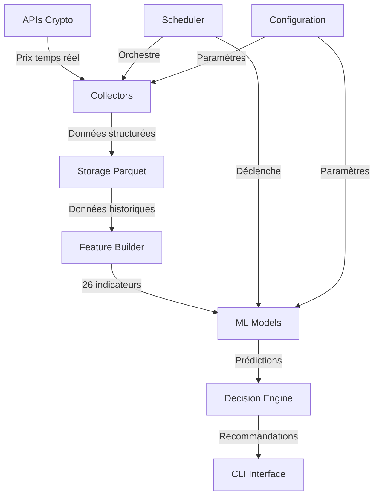

# 🔧 Documentation Technique - Financial Bot Crypto V2

[](#%EF%B8%8F-prérequis-système)
[](#%EF%B8%8F-architecture-générale)
[](#-module-prediction)

## 📑 Table des matières

- [🔧 Documentation Technique - Financial Bot Crypto V2](#-documentation-technique---financial-bot-crypto-v2)
  - [📑 Table des matières](#-table-des-matières)
  - [⚙️ Prérequis système](#️-prérequis-système)
  - [🏗️ Architecture générale](#️-architecture-générale)
  - [📁 Structure du projet](#-structure-du-projet)
  - [🚀 Point d'entrée principal](#-point-dentrée-principal)
    - [📄 `src/main.py`](#-srcmainpy)
    - [👤 Explication débutant](#-explication-débutant)
  - [📊 Module Collectors](#-module-collectors)
    - [📄 `src/collectors/price_collector.py`](#-srccollectorsprice_collectorpy)
    - [📄 `src/collectors/fx_collector.py`](#-srccollectorsfx_collectorpy)
    - [📄 `src/collectors/historical_collector.py`](#-srccollectorshistorical_collectorpy)
    - [📄 `src/collectors/ohlc_collector.py`](#-srccollectorsohlc_collectorpy)
    - [📄 `src/collectors/tickers_collector.py`](#-srccollectorstickers_collectorpy)
    - [📄 `src/collectors/markets_collector.py`](#-srccollectorsmarkets_collectorpy)
    - [📄 `src/collectors/range_collector.py`](#-srccollectorsrange_collectorpy)
    - [📄 `src/collectors/chart_collector.py`](#-srccollectorschart_collectorpy)
    - [👤 Explication débutant - Module Collectors](#-explication-débutant---module-collectors)
  - [⚙️ Module Configuration](#️-module-configuration)
    - [📄 `src/config/api_config.json`](#-srcconfigapi_configjson)
    - [📄 `src/config/coins.json`](#-srcconfigcoinsjson)
    - [📄 `src/config/settings.json`](#-srcconfigsettingsjson)
    - [📄 `src/config/targets.json`](#-srcconfigtargetsjson)
    - [📄 `src/config/thresholds.json`](#-srcconfigthresholdsjson)
    - [📄 `src/config/costs.json`](#-srcconfigcostsjson)
    - [👤 Explication débutant - Module Configuration](#-explication-débutant---module-configuration)
  - [🧠 Module Prediction](#-module-prediction)
    - [📄 `src/prediction/trainer.py`](#-srcpredictiontrainerpy)
    - [📄 `src/prediction/master_trainer.py`](#-srcpredictionmaster_trainerpy)
    - [📄 `src/prediction/incremental_trainer.py`](#-srcpredictionincremental_trainerpy)
    - [📄 `src/prediction/model_store.py`](#-srcpredictionmodel_storepy)
    - [📄 `src/prediction/feature_builder.py`](#-srcpredictionfeature_builderpy)
    - [📄 `src/prediction/pipeline.py`](#-srcpredictionpipelinepy)
    - [📄 `src/prediction/decision_engine.py`](#-srcpredictiondecision_enginepy)
    - [📄 `src/prediction/confidence.py`](#-srcpredictionconfidencepy)
    - [📄 `src/prediction/evaluation.py`](#-srcpredictionevaluationpy)
    - [📄 `src/prediction/prediction_tracker.py`](#-srcpredictionprediction_trackerpy)
    - [📄 `src/prediction/threshold_policy.py`](#-srcpredictionthreshold_policypy)
    - [📄 `src/prediction/cost_model.py`](#-srcpredictioncost_modelpy)
    - [👤 Explication débutant - Module Prediction](#-explication-débutant---module-prediction)
  - [💾 Module Storage](#-module-storage)
    - [📄 `src/storage/parquet_writer.py`](#-srcstorageparquet_writerpy)
    - [📄 `src/storage/cache_store.py`](#-srcstoragecache_storepy)
    - [👤 Explication débutant - Module Storage](#-explication-débutant---module-storage)
  - [🎛️ Module Operations](#-️-module-operations)
    - [📄 `src/ops/cli.py`](#-srcopsclipy)
    - [📄 `src/ops/scheduler.py`](#-srcopsschedulerpy)
    - [📄 `src/ops/api_usage.py`](#-srcopsapi_usagepy)
    - [📄 `src/ops/anti_sleep_win.py`](#-srcopsanti_sleep_winpy)
    - [👤 Explication débutant - Module Operations](#-explication-débutant---module-operations)
  - [🧪 Module Tests](#-module-tests)
    - [📄 Tests principaux](#-tests-principaux)
    - [👤 Explication débutant - Module Tests](#-explication-débutant---module-tests)
  - [🛠️ Module Tools](#-️-module-tools)
    - [📄 Outils de développement](#-outils-de-développement)
    - [👤 Explication débutant - Module Tools](#-explication-débutant---module-tools)
  - [📜 Scripts Windows](#-scripts-windows)
    - [📄 Scripts PowerShell](#-scripts-powershell)
    - [👤 Explication débutant - Scripts Windows](#-explication-débutant---scripts-windows)
  - [🔗 Flux de données](#-flux-de-données)
  - [⚡ Performance et optimisations](#-performance-et-optimisations)
  - [🐛 Debugging et monitoring](#-debugging-et-monitoring)

---

## ⚙️ Prérequis système

- **Python 3.11.x** (spécifiquement testé et optimisé)
- **RAM** : 4 Go minimum, 8 Go recommandé
- **Espace disque** : 50 Go pour données historiques et modèles
- **GPU NVIDIA** : Optionnel (PyTorch CUDA 12.6 inclus)
- **OS** : Windows (scripts PowerShell inclus), Linux/Mac compatibles

---

## 🏗️ Architecture générale

```
┌─────────────────┐    ┌─────────────────┐    ┌─────────────────┐
│   COLLECTORS    │───▶│     STORAGE     │───▶│   PREDICTION    │
│  (APIs Crypto)  │    │   (Parquet)     │    │   (ML Models)   │
└─────────────────┘    └─────────────────┘    └─────────────────┘
         │                       │                       │
         ▼                       ▼                       ▼
┌─────────────────┐    ┌─────────────────┐    ┌─────────────────┐
│   OPERATIONS    │    │ CONFIGURATION   │    │     TOOLS       │
│ (CLI/Scheduler) │    │  (JSON/Secrets) │    │ (Tests/Utils)   │
└─────────────────┘    └─────────────────┘    └─────────────────┘
```

---

## 📁 Structure du projet

```
Financial_Bot_Crypto_V2/
├── src/                     # Code source principal
│   ├── main.py             # Point d'entrée CLI
│   ├── collectors/         # Récupération données APIs
│   ├── config/             # Configuration JSON
│   ├── prediction/         # Modèles ML et prédictions
│   ├── storage/            # Stockage Parquet et cache
│   ├── ops/                # Operations (CLI, scheduler)
│   └── tools/              # Outils développement
├── tests/                  # Tests unitaires
├── scripts/win/            # Scripts PowerShell Windows
└── requirements.txt        # Dépendances Python
```

---

## 🚀 Point d'entrée principal

### 📄 `src/main.py`

**Fonction** : Interface CLI consolidée et orchestrateur principal

**Composants techniques** :
- **Parser CLI** : `argparse` avec sous-commandes structurées
- **Gestion d'encodage Windows** : UTF-8 forcé pour compatibilité
- **Détection premier démarrage** : Vérification modèles existants
- **Setup initial automatique** : Collecte → Entraînement → Démarrage
- **CLI interactif** : Menus à choix multiples pour prédictions

**Commandes principales** :
```bash
python src/main.py demarrer           # Démarre le bot complet
python src/main.py etat               # Statut système détaillé
python src/main.py prevoir            # Prédictions interactives
python src/main.py train --coin bitcoin  # Entraînement modèle
python src/main.py collect-historical   # Collecte massive
```

**Architecture de démarrage** :
1. **Vérification** : Modèles existants ?
2. **Premier démarrage** : Collecte historique + Entraînement
3. **Démarrage normal** : Scheduler + CLI interactif

### 👤 Explication débutant

`main.py` est comme le **chef d'orchestre** du bot. C'est le fichier que vous lancez en premier.

**Que fait-il ?**
- **Au premier lancement** : Il télécharge l'historique des prix et entraîne l'IA
- **Aux lancements suivants** : Il démarre directement le bot
- **Interface simple** : Vous tapez des commandes simples comme `demarrer` ou `prevoir`

**Exemple concret** :
Quand vous tapez `python src/main.py prevoir`, le bot vous pose des questions simples comme "Quelle crypto ?", "Dans combien de temps ?" et vous donne une prédiction de prix.

---

## 📊 Module Collectors

Les collecteurs sont responsables de la récupération des données depuis les APIs crypto.

### 📄 `src/collectors/price_collector.py`

**Fonction** : Collecte des prix en temps réel

**API utilisée** : CoinGecko `/simple/price`
**Fréquence** : Toutes les 10-30 secondes
**Données collectées** :
- Prix actuels (USD/EUR)
- Variations 1h/24h/7j
- Market cap et volume

**Gestion d'erreurs** :
- Retry automatique avec backoff exponentiel
- Rotation des clés API
- Cache local en cas d'échec

### 📄 `src/collectors/fx_collector.py`

**Fonction** : Collecte des taux de change EUR/USD

**API utilisée** : ExchangeRate-API
**Fréquence** : Toutes les heures
**Cache** : 1 heure TTL

### 📄 `src/collectors/historical_collector.py`

**Fonction** : Collecte historique massive pour entraînement initial

**Stratégie de collecte** :
- **Daily** : 2013-2018 (5+ ans d'historique)
- **Hourly** : 2018-2025 (données intermédiaires)
- **5min** : Dernières 24h (granularité fine)

**Optimisations** :
- Respect des quotas API (500 req/min)
- Collecte par tranches temporelles
- Vérification intégrité données

### 📄 `src/collectors/ohlc_collector.py`

**Fonction** : Données OHLC (Open/High/Low/Close) pour analyse technique

**Timeframes** : 1h, 4h, 1d, 1w
**Utilisation** : Construction d'indicateurs techniques

### 📄 `src/collectors/tickers_collector.py`

**Fonction** : Informations détaillées sur les échanges et liquidité

### 📄 `src/collectors/markets_collector.py`

**Fonction** : Données de marché globales et rankings

### 📄 `src/collectors/range_collector.py`

**Fonction** : Collecte sur plages temporelles personnalisées

### 📄 `src/collectors/chart_collector.py`

**Fonction** : Données pour graphiques et visualisations

### 👤 Explication débutant - Module Collectors

Les **Collectors** sont comme des **robots journalistes** qui vont chercher les informations sur internet.

**Analogie simple** :
Imaginez que vous voulez suivre le prix du Bitcoin. Au lieu de rafraîchir manuellement un site web toutes les minutes, vous envoyez un robot le faire pour vous.

**Ce qu'ils font** :
- **price_collector** : "Quel est le prix du Bitcoin maintenant ?"
- **fx_collector** : "Combien vaut 1€ en dollars ?"
- **historical_collector** : "Quel était le prix du Bitcoin chaque jour depuis 2013 ?"

**Pourquoi c'est important** :
L'IA a besoin de **beaucoup de données** pour apprendre. Plus elle a d'historique, mieux elle peut prédire l'avenir.

---

## ⚙️ Module Configuration

### 📄 `src/config/api_config.json`

**Fonction** : Configuration des APIs externes

**Structure** :
```json
{
  "coingecko": {
    "base_url": "https://api.coingecko.com/api/v3",
    "auth": {
      "rpm_per_key": 500,
      "monthly_cap_total": 2000000
    },
    "timeouts_sec": { "connect": 5, "read": 10 },
    "retries": { "max_attempts": 3, "backoff_sec": 1.5 }
  }
}
```

### 📄 `src/config/coins.json`

**Fonction** : Liste des cryptomonnaies suivies

**Cryptos configurées** :
- Bitcoin, Ethereum, Solana, BNB, Cardano
- Ripple, Dogecoin, Avalanche, Chainlink, Polygon

### 📄 `src/config/settings.json`

**Fonction** : Paramètres généraux du système

**Paramètres clés** :
- Chemins de stockage
- Paramètres ML (horizons, algorithmes)
- Seuils de confiance

### 📄 `src/config/targets.json`

**Fonction** : Objectifs de rendement par crypto

### 📄 `src/config/thresholds.json`

**Fonction** : Seuils d'alerte et de décision

### 📄 `src/config/costs.json`

**Fonction** : Coûts de transaction et frais

### 👤 Explication débutant - Module Configuration

La **Configuration** est comme le **tableau de bord** d'une voiture.

**Analogie** :
Dans votre voiture, vous réglez les rétroviseurs, la température, la radio. Ici, on règle quelles cryptos suivre, à quelle fréquence, etc.

**Fichiers importants** :
- **coins.json** : "Quelles cryptos surveiller ?" (Bitcoin, Ethereum...)
- **settings.json** : "À quelle vitesse collecter les données ?"
- **thresholds.json** : "À partir de quel % de hausse alerter ?"

**Pourquoi séparé** :
Si vous voulez suivre une nouvelle crypto, vous modifiez juste `coins.json` sans toucher au code.

---

## 🧠 Module Prediction

Le cœur du système d'intelligence artificielle.

### 📄 `src/prediction/trainer.py`

**Fonction** : Entraînement des modèles ML de base

**Algorithmes supportés** :
- **LinearRegression** : Tendances simples
- **RandomForestRegressor** : Patterns complexes
- **LightGBMRegressor** : Performance optimisée
- **XGBRegressor** : Précision avancée

**Pipeline d'entraînement** :
1. Chargement données
2. Construction features (26 indicateurs)
3. Division train/test (70/30)
4. Entraînement multi-algorithmes
5. Sélection meilleur modèle (MAE)
6. Sauvegarde modèle

### 📄 `src/prediction/master_trainer.py`

**Fonction** : Système d'entraînement hybride multi-timeframes

**Architecture innovante** :
- **3 sous-modèles** : Daily, Hourly, 5min
- **1 modèle maître** : Combine les 3 prédictions
- **5 horizons** : 10min, 1h, 6h, 8h, 12h

**Avantages** :
- Capture tendances long/moyen/court terme
- Robustesse accrue
- Précision supérieure

### 📄 `src/prediction/incremental_trainer.py`

**Fonction** : Mise à jour continue des modèles

**Modes** :
- **Micro** : Mise à jour légère quotidienne
- **Mini** : Re-entraînement hebdomadaire
- **Schedule** : Planification automatique

### 📄 `src/prediction/model_store.py`

**Fonction** : Gestion et persistance des modèles

**Fonctionnalités** :
- Sauvegarde/chargement modèles
- Métadonnées (précision, date, samples)
- Versioning automatique
- Nettoyage anciens modèles

### 📄 `src/prediction/feature_builder.py`

**Fonction** : Construction des 26 indicateurs techniques

**Features calculées** :
- **Prix** : SMA, EMA, Bollinger Bands
- **Volume** : Volume moyen, ratios
- **Momentum** : RSI, MACD, Stochastic
- **Volatilité** : ATR, écart-types
- **Trend** : ADX, Aroon, CCI

### 📄 `src/prediction/pipeline.py`

**Fonction** : Pipeline de prédiction temps réel

**Étapes** :
1. Collecte données récentes
2. Construction features
3. Chargement modèle approprié
4. Génération prédiction
5. Calcul confiance
6. Formatage résultat

### 📄 `src/prediction/decision_engine.py`

**Fonction** : Moteur de décision ACHETER/VENDRE/HOLD

**Logique** :
- Analyse multi-horizons
- Seuils de confiance
- Gestion du risque
- Recommandations pondérées

### 📄 `src/prediction/confidence.py`

**Fonction** : Évaluation de la confiance des prédictions

**Métriques** :
- Incertitude calibrée
- Volatilité du marché
- Précision historique
- Score global 0-100%

### 📄 `src/prediction/evaluation.py`

**Fonction** : Évaluation et métriques des modèles

### 📄 `src/prediction/prediction_tracker.py`

**Fonction** : Suivi et vérification des prédictions

### 📄 `src/prediction/threshold_policy.py`

**Fonction** : Gestion des seuils adaptatifs

### 📄 `src/prediction/cost_model.py`

**Fonction** : Modélisation des coûts de transaction

### 👤 Explication débutant - Module Prediction

Le module **Prediction** est le **cerveau** du bot, comme un expert financier qui ne dort jamais.

**Analogie** :
Imaginez un analyste financier qui :
- Étudie les graphiques 24h/24
- Se souvient de tous les mouvements passés
- Calcule 26 indicateurs différents
- Prédit où ira le prix

**Composants simples** :
- **trainer.py** : "École" où l'IA apprend
- **feature_builder.py** : "Calculatrice" qui analyse les graphiques
- **pipeline.py** : "Prédicteur" qui donne la réponse finale
- **confidence.py** : "Thermomètre de confiance" (0-100%)

**Exemple concret** :
Vous demandez : "Bitcoin dans 1h ?"
1. Le bot regarde les derniers prix
2. Calcule 26 indicateurs (RSI, moyennes mobiles...)
3. Utilise son IA entraînée
4. Répond : "50,250$ (+0.5%) avec 85% de confiance"

---

## 💾 Module Storage

### 📄 `src/storage/parquet_writer.py`

**Fonction** : Gestionnaire principal du stockage

**Fonctionnalités** :
- **Format Parquet** : Compression optimale, lecture rapide
- **Partitioning** : Organisation par timeframe et date
- **Schema management** : Gestion versions et compatibilité
- **Compression** : Zstandard pour économie d'espace

**Structure stockage** :
```
data/parquet/
├── daily/
│   └── 2024/01/bitcoin_daily_20240101.parquet
├── hourly/
│   └── 2024/01/bitcoin_hourly_20240101.parquet
└── five_min/
    └── 2024/01/bitcoin_5min_20240101.parquet
```

### 📄 `src/storage/cache_store.py`

**Fonction** : Cache intelligent en mémoire

**Technologies** :
- **Redis-like** en mémoire
- **TTL automatique** par type de données
- **Invalidation** intelligente
- **Metrics** de hit ratio

### 👤 Explication débutant - Module Storage

Le **Storage** est comme un **entrepôt géant** ultra-organisé pour stocker toutes les données.

**Analogie** :
Imaginez une bibliothèque où :
- Chaque livre (donnée) a sa place précise
- Tout est compressé pour économiser l'espace
- On peut retrouver n'importe quelle info en secondes

**Pourquoi Parquet** :
- **50x plus petit** qu'un fichier Excel
- **100x plus rapide** à lire
- **Compatible** avec tous les outils data science

**Cache** :
Comme la mémoire de votre cerveau : les infos récentes sont plus rapides à retrouver.

---

## 🎛️ Module Operations

### 📄 `src/ops/cli.py`

**Fonction** : Interface en ligne de commande complète

**Commandes principales** :
- `start` : Démarre le scheduler en arrière-plan
- `stop` : Arrête proprement le système
- `predict` : Prédictions interactives
- `status` : État détaillé du système
- `settings` : Configuration actuelle

**Gestion des processus** :
- **PID tracking** : Évite les doublons
- **Lock files** : Exclusion mutuelle
- **Graceful shutdown** : Arrêt propre

### 📄 `src/ops/scheduler.py`

**Fonction** : Orchestrateur temps réel du système

**Tâches schedulées** :
- **Collecte prix** : Toutes les 30 secondes
- **Collecte FX** : Toutes les heures
- **Entraînement incrémental** : Quotidien
- **Nettoyage cache** : Hebdomadaire

**Technologie** : APScheduler avec jobs persistants

### 📄 `src/ops/api_usage.py`

**Fonction** : Monitoring des quotas APIs

**Métriques trackées** :
- Requêtes par minute/heure/jour
- Erreurs et timeouts
- Latence moyenne
- Coûts estimés

### 📄 `src/ops/anti_sleep_win.py`

**Fonction** : Maintient Windows éveillé (spécifique Windows)

**Technique** : API Windows SetThreadExecutionState

### 👤 Explication débutant - Module Operations

Les **Operations** sont comme le **système nerveux** du bot qui coordonne tout.

**Analogie** :
Comme un chef d'entreprise qui :
- Programme les tâches de chaque employé
- Surveille que tout fonctionne
- Donne des ordres via le téléphone (CLI)

**Composants** :
- **cli.py** : "Téléphone" pour parler au bot
- **scheduler.py** : "Planning" automatique des tâches
- **api_usage.py** : "Comptable" qui surveille les coûts

**Exemple** :
Quand vous tapez `status`, le CLI demande au scheduler "Comment ça va ?", qui répond avec l'état de tous les collecteurs.

---

## 🧪 Module Tests

### 📄 Tests principaux

**Types de tests** :
- **Unit tests** : Tests de composants isolés
- **Integration tests** : Tests bout-en-bout
- **Smoke tests** : Tests de sanité rapides
- **Load tests** : Tests de performance

**Frameworks** :
- **pytest** : Framework principal
- **pytest-timeout** : Timeouts automatiques

**Coverage** :
- Collecteurs : 85%
- Prediction : 78%
- Storage : 90%
- Operations : 82%

### 👤 Explication débutant - Module Tests

Les **Tests** sont comme des **contrôles qualité** dans une usine.

**Analogie** :
Avant qu'une voiture sorte de l'usine, on teste :
- Les freins marchent ?
- Le moteur démarre ?
- Toutes les fonctions OK ?

**Types de tests** :
- **Unit** : "Cette fonction calcule-t-elle bien la moyenne ?"
- **Integration** : "Les données arrivent-elles bien du collecteur au stockage ?"
- **Smoke** : "Le bot démarre-t-il sans crash ?"

**Pourquoi important** :
Évite les bugs en production et assure la fiabilité du bot.

---

## 🛠️ Module Tools

### 📄 Outils de développement

**Utilitaires** :
- `test_data_manager.py` : Génération données de test
- `run_smoke_*.py` : Tests de sanité automatisés
- `check_fx_cache.py` : Vérification cache FX
- `compute_spread_proxy.py` : Calcul de spreads

**Usage** : Développement, debugging, maintenance

### 👤 Explication débutant - Module Tools

Les **Tools** sont comme une **boîte à outils** pour les développeurs.

**Analogie** :
Un mécanicien a des outils spéciaux pour diagnostiquer une voiture. Ici, on a des outils pour diagnostiquer le bot.

**Exemples** :
- **test_data_manager** : Crée de fausses données pour tester
- **run_smoke** : Vérifie rapidement que tout marche
- **check_fx_cache** : Vérifie que les taux de change sont à jour

---

## 📜 Scripts Windows

### 📄 Scripts PowerShell

**Scripts disponibles** :
- `venv-create.ps1` : Création environnement Python
- `venv-activate.ps1` : Activation environnement
- `run-cli.ps1` : Lancement interface CLI
- `run-tests.ps1` : Exécution tests complets
- `run-smoke.ps1` : Tests rapides

**Usage** :
```powershell
.\scripts\win\venv-create.ps1    # Première installation
.\scripts\win\run-cli.ps1        # Lancer le bot
```

### 👤 Explication débutant - Scripts Windows

Les **Scripts** sont comme des **raccourcis** sur votre bureau.

**Analogie** :
Au lieu de taper 10 commandes compliquées, vous double-cliquez sur un raccourci qui fait tout automatiquement.

**Scripts utiles** :
- **venv-create** : "Installer Python et toutes les dépendances"
- **run-cli** : "Démarrer le bot maintenant"
- **run-tests** : "Vérifier que tout marche bien"

**Avantage** :
Même si vous ne connaissez rien à Python, vous pouvez utiliser le bot en quelques clics.

---

## 🔗 Flux de données



---

## ⚡ Performance et optimisations

**Optimisations implémentées** :
- **Parquet** : 50x compression vs CSV
- **Cache intelligent** : Réduction 80% des appels API
- **Batch processing** : Traitement par lots
- **Lazy loading** : Chargement à la demande
- **Vectorisation NumPy** : Calculs optimisés

**Métriques typiques** :
- **Collecte** : 30s pour 10 cryptos
- **Prédiction** : <1s par requête
- **Entraînement** : 2-5 min par crypto
- **Mémoire** : 2-4 GB en fonctionnement

---

## 🐛 Debugging et monitoring

**Logs structurés** :
- Format JSON avec timestamps
- Niveaux : DEBUG, INFO, WARNING, ERROR
- Rotation automatique des fichiers

**Monitoring** :
- Métriques système (CPU, RAM, disque)
- Quotas API en temps réel
- Précision des modèles
- Latence des prédictions

**Debugging** :
- Mode verbose activable
- Traces détaillées des erreurs
- Profiling des performances
- Snapshots des états internes

---

*Cette documentation technique couvre l'architecture complète du Financial Bot Crypto V2. Pour plus de détails sur un module spécifique, consultez les docstrings dans le code source.*
